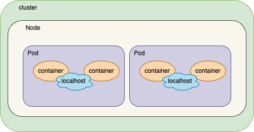

Cluster architechture

I. Node 

    master node like a master ship
    workers node like slaves ship, master plan, schedule, monitor nodes

II. ETCD cluster

    Key-value store, all value of all ship

II. Kube scheduler

    Like cranes, what container will ship to what ships
    Identify a right container place in right nodes
    Node capacity

IV: Controller Manager

    control node status and replicas

V: Kube api server

    Comunication outside, interval fetch data from worker nodes, kube-schedule, controller

VI: kubelet

    A Caption of node, report to the master

VII: kube-proxy

    networking, iptables

VIII. pods

K8s only workwith docker, don't support any container solution
CRI (container runtime interface): standard for interface for vendors, like [containerd](https://github.com/containerd/containerd), [rkt](https://github.com/rkt/rkt)

k run ... #deploy a pod

k8s with yaml

    4 field requeried
    apiVersion: string
    kind: string
    metadata: dict
    spec: dict