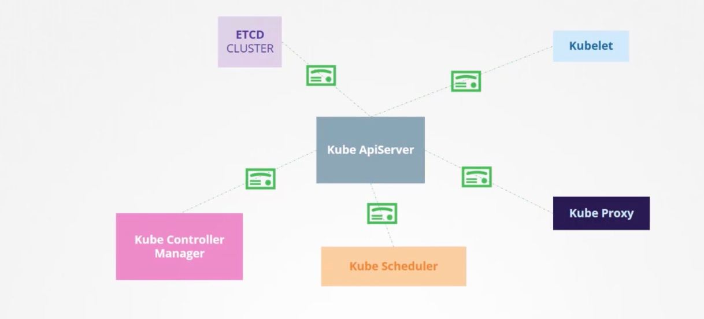

I. authentication

kube-apiserver
    - apiserver.ctr # public
    - apiserver.key # private
    - ca.ctr # verify pubkey

Generate CA

    $ openssl genrsa -out ca.key 2048
    $ openssl req -new -key ca.key -subj "/CN=KUBERNETES-CA" -out ca.csr
    $ openssl x509 -req -in ca.csr -signkey ca.key -out ca.crt

etcd:

    - --peer-cert-file=xxx/peer.crt
    - --peer-key-file=xxx/peer.key
    - --peer-trusted-ca-file=xxx/ca.crt
Kube-apiserver

    central of node, interactive with kubectl command
    --client-ca-file=xxx/ca.pem
    --tls-cert-file=xxx/apiserver.crt
    --tls-private-key-file=xxx/apiserver.key

Views cert details:

    the hard way: openssl
        $ openssl x509 -in xxx/apiserver.crt -text -noout

    using kubeadm
        $ kubeadm certs check-expiration

